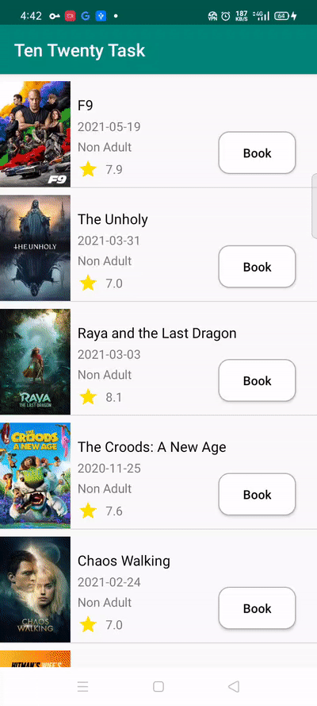

# Ten twenty task

This is an android kotlin project used

1. Use [Retrofit](https://square.github.io/retrofit/) to retrieve upcoming movies from [The Movie DB](https://www.themoviedb.org/) and display the data in an Activity.
2. Use [RecyclerView](https://developer.android.com/guide/topics/ui/layout/recyclerview) to display a list of textual data
3. Use [MVVM](https://developer.android.com/jetpack/guide?gclid=CjwKCAjww-CGBhALEiwAQzWxOubUgF5jn_KjEnDkYITEPXmW_7xE7AJNRs9nGUcwUmtZBcZfFczXnxoCQXMQAvD_BwE&gclsrc=aw.ds) for better architecture and app performance
4. Use [ConstraintLayout](https://developer.android.com/training/constraint-layout) for responsive layout

## Using Retrofit to Retrieve and Display Data with REST API

App features:
1. displaying all upcoming movies using TMDB API
2. can book tickets
3. retrieved movie name, genres, adult, poster image, trailer from api
4. watch trailer, as tmdb only provides youtube urls so, i am playing trailer using youtube

The required data of upcoming movies can be retrieved by the following REST API:

https://api.themoviedb.org/3/movie/upcoming?api_key=YOUR_API_KEY

as poster image path cant shown with glide directly so i concatenate the following path to display poster image

https://image.tmdb.org/t/p/w500/POSTER_PATH

used [Glide](https://github.com/bumptech/glide) to download the poster image from the above URL and put it into the `ImageView` in your `MovieListAdapter`.
